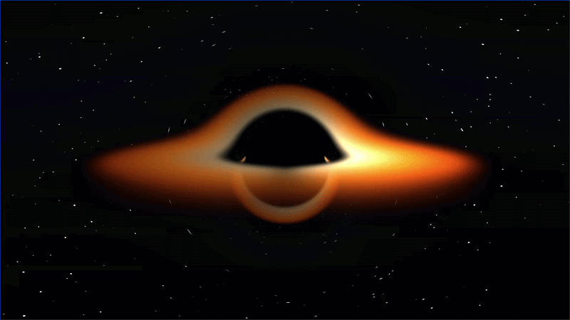

# Schwarzschild

Real-time ray-casting simulation of a Schwarzschild black hole, built with Rust + wgpu + WGSL.



## Features

- Relativistic null geodesics integrated with RK4 on the GPU
- Photon Sphere and gravitational lensing
- Accretion disk with Doppler beaming and gravitational redshift
- Interactive orbital camera (mouse drag + scroll)
- ~2M geodesics computed per frame in parallel

## Physics

Each pixel corresponds to one photon trajectory, governed by the Schwarzschild geodesic equation:

$$\frac{d^2u}{d\varphi^2} + u = \frac{3}{2}\, r_s\, u^2$$

Full derivation and algorithmic documentation: [schwarzschild_physics.pdf](docs/schwarzschild_physics.pdf)

## Stack

|           |                                          |
|-----------|------------------------------------------|
| Language  | Rust                                     |
| GPU API   | wgpu 29 (Vulkan / Metal / DX12 / WebGPU) |
| Shaders   | WGSL                                     |
| Windowing | winit 0.30                               |
| Math      | glam                                     |


## Build & Run

```bash
cargo run --release
```

## Controls

- Left mouse drag - orbit around the black hole
- Scroll wheel - zoom in / out

## License

[MIT](LICENSE.md)